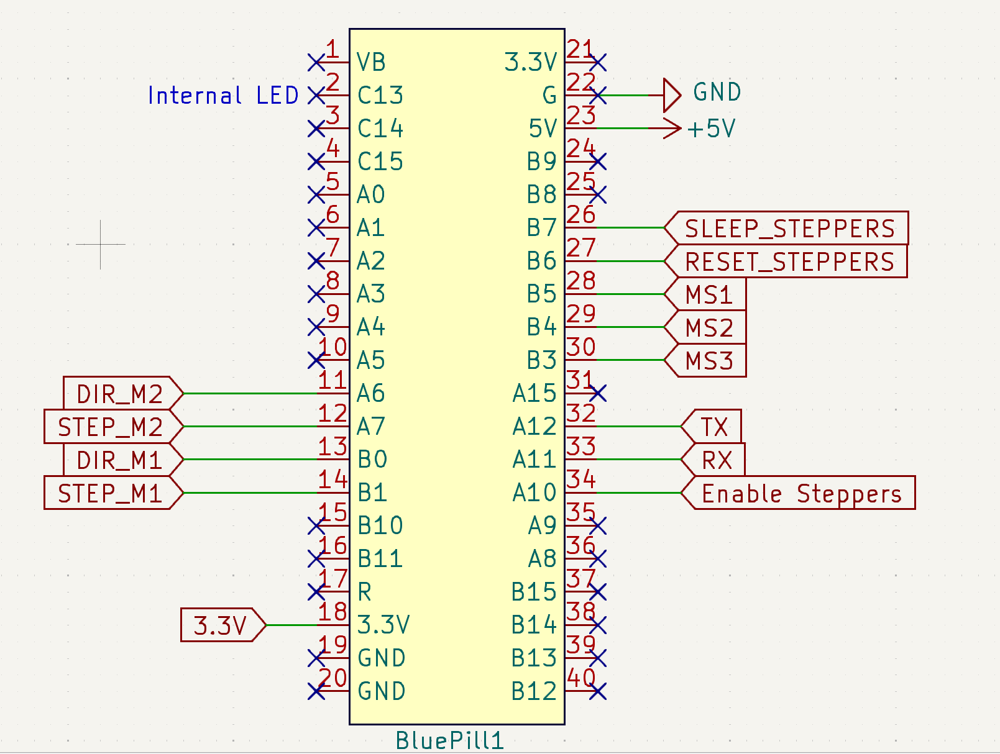
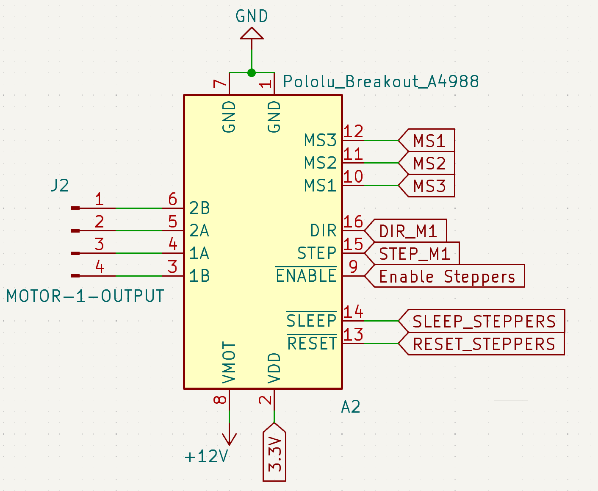
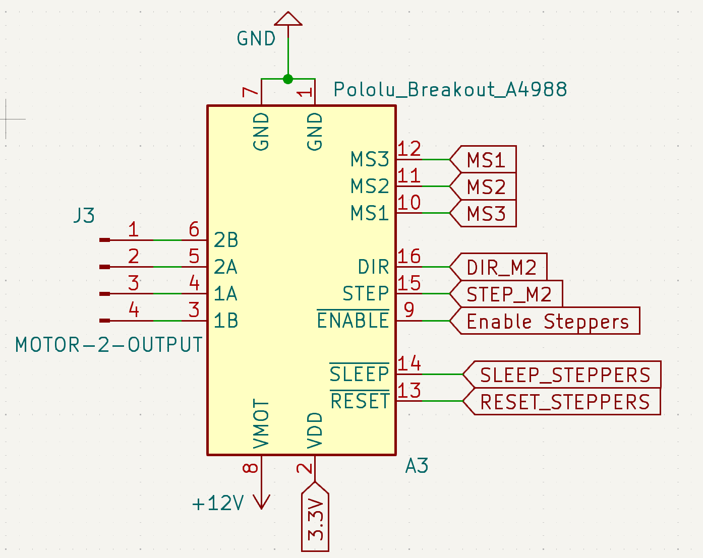
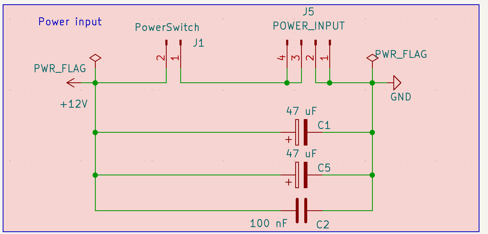
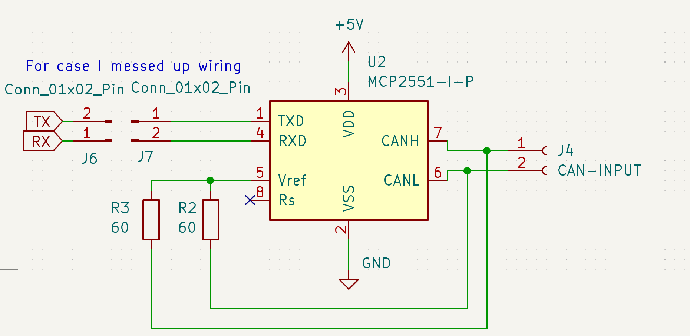
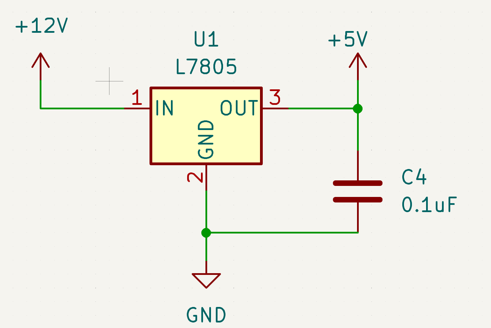
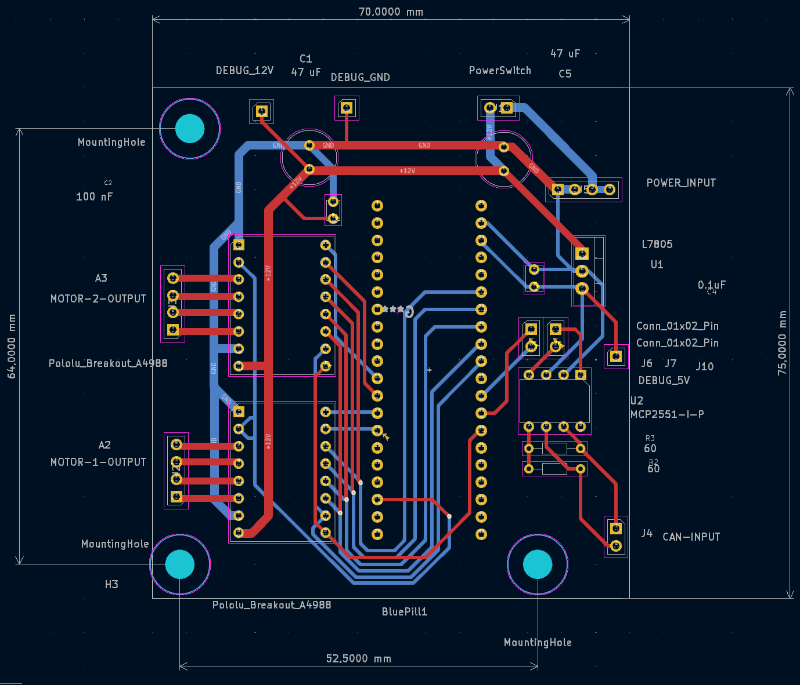
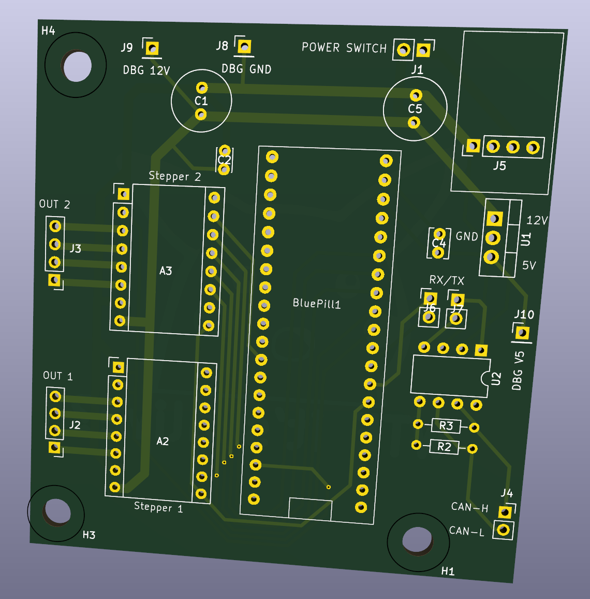
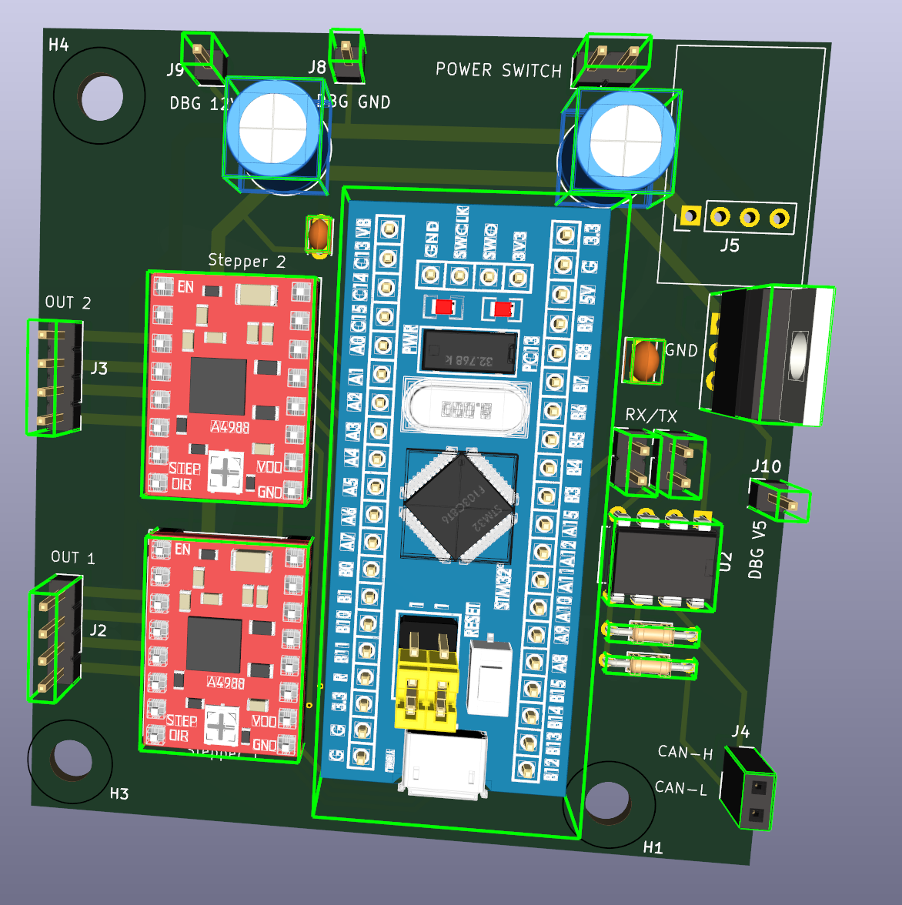

# WritingRobot
Draw anything using robot!

## Overview

Robot is made of:
- Control part that runs on __Raspberry PI4__
- CAN communication using __MPC2515__ modules
- <del>__Arduino__ Nano clone</del>
- STM32 Bluepill (STM32F103C6T6
- Two __stepper motors drivers__

# Schemes

## Electrical wiring

Arduino:

Stepper motors

Powerline

MCP2551 CANH/L -> Rx/Tx data module

L7805 -> 12V -> 5V/1A 

## Board design

Wiring scheme of actual PCB

3D view to the board without and with modules

