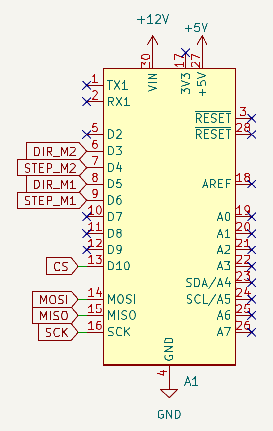
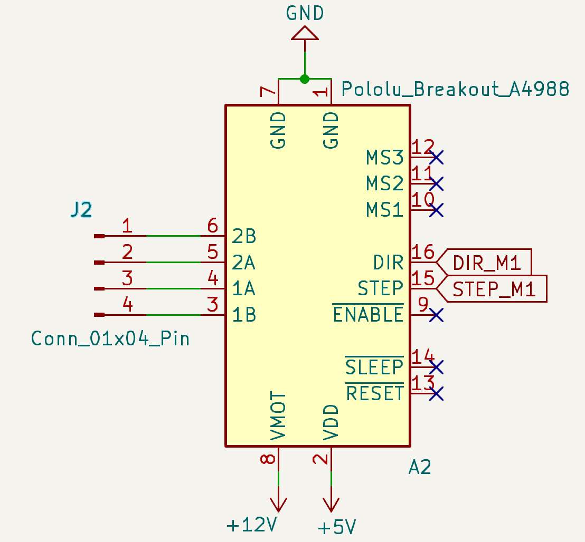
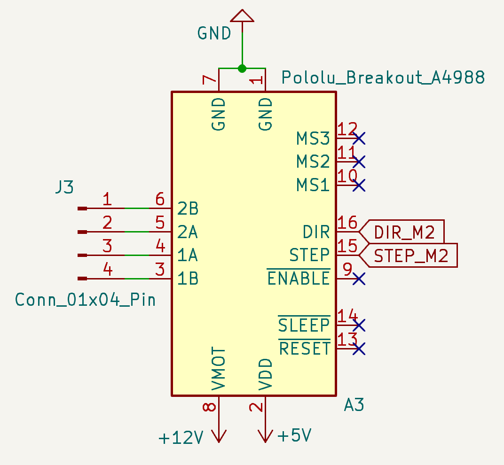
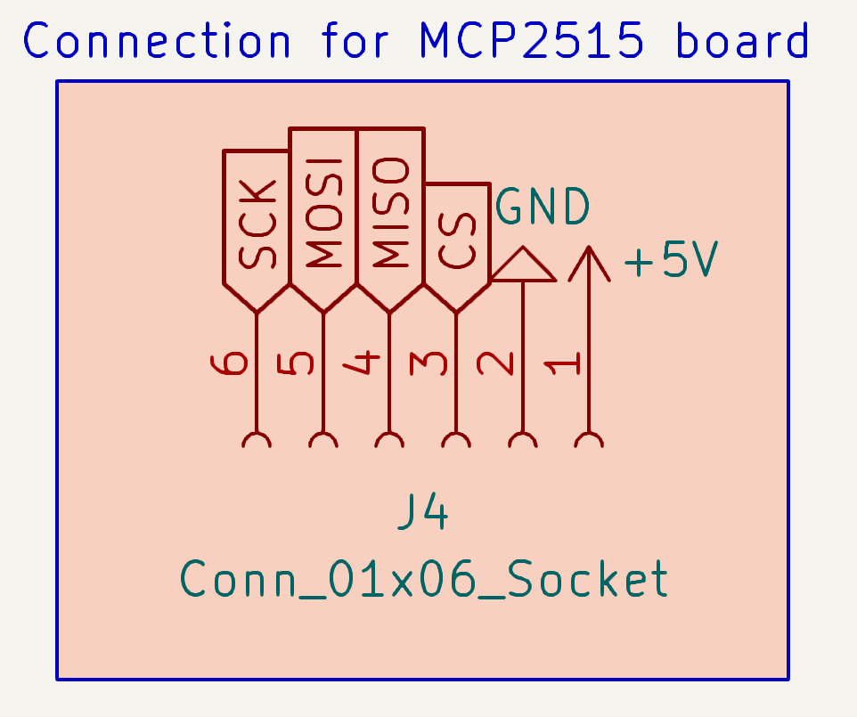
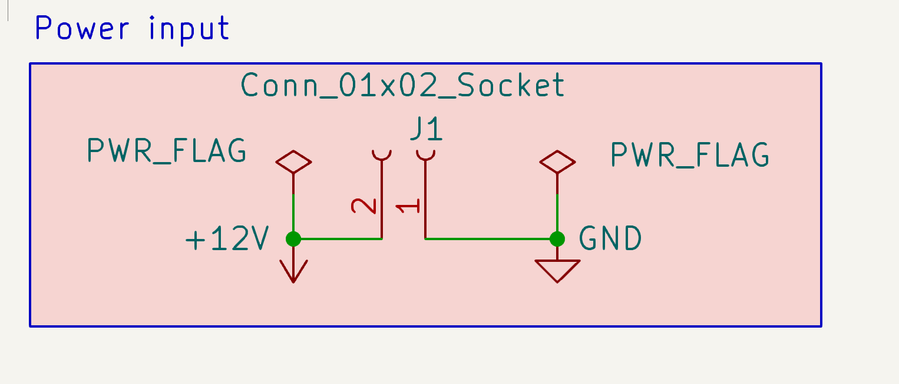
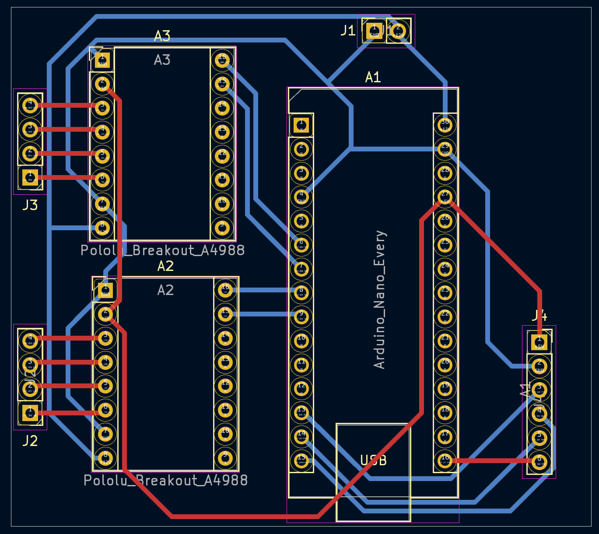
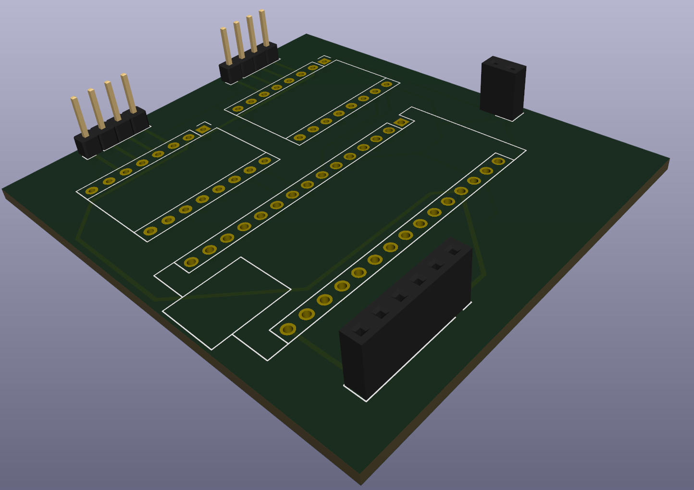
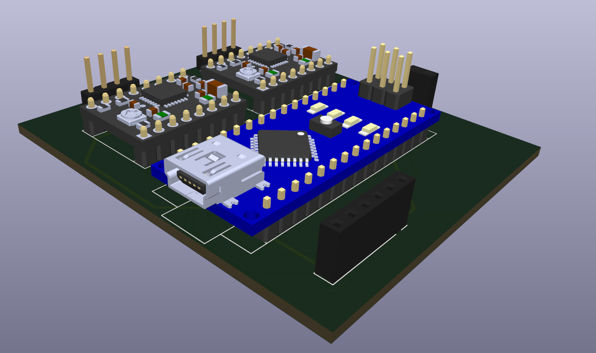

# WritingRobot
Draw anything using robot!

## Overview

Robot is made of:
- Control part that runs on __Raspberry PI4__
- CAN communication using __MPC2515__ modules
- __Arduino__ Nano clone
- Two __stepper motors drivers__

# Schemes

## Electrical wiring

Arduino:

Stepper motors

Connection to CAN MCP2515 module

Powerline

## Board design

Wiring scheme of actual PCB

3D view to the board without and with modules

